<!-- # The Digital Frontline: A Comprehensive Analysis of Israel-Hamas Discourse
### Comparative Study of Reddit and YouTube
**Date:** November 27, 2025

Akshat Gupta, Raghav Sarna, Arsh Arora, Mudasir Rasheed -->

---
title: "The Digital Frontline: A Comprehensive Analysis of Israel-Hamas Discourse"
subtitle: "Comparative Study of Reddit and YouTube"
author: "Akshat Gupta, Raghav Sarna, Arsh Arora, Mudasir Rasheed"
date: "November 27, 2025"
geometry: margin=1in
fontsize: 11pt
colorlinks: true
header-includes:
  - \usepackage{fancyhdr}
  - \pagestyle{fancy}
  - \fancyhead[L]{Israel-Hamas Discourse Analysis}
  - \fancyhead[R]{\thepage}
  - \fancyfoot[C]{}
  - \usepackage{float}
  - \let\origfigure\figure
  - \let\endorigfigure\endfigure
  - \renewenvironment{figure}[1][2] {\expandafter\origfigure\expandafter[H]} {\endorigfigure}
---

---

# Introduction & Research Questions

The Israel-Hamas conflict is not just fought on the ground but also in the digital sphere. This study analyzes **19,362 comments** (9,973 from Reddit, 9,389 from YouTube) to understand how platform architecture shapes political discourse.

We structured our inquiry around four key research questions:

*   **RQ1 (Sentiment):** How does the emotional tone differ between the debate-centric Reddit and the media-centric YouTube?

*   **RQ2 (Framing):** What distinct topics and narratives emerge on each platform?

*   **RQ3 (Polarization):** To what extent do echo chambers exist, and are users consistent in their stance?

*   **RQ4 (Toxicity):** Which platform—and which political stance—harbors the most toxic and harmful speech?

---

# The Sentiment Divide

Our initial analysis revealed a stark contrast in the emotional landscape of the two platforms.

## Sentiment Distribution & Polarity

*   **Reddit (The Debate Hall):** Skews **Negative (45%)**. The discourse is critical, argumentative, and cynical.

*   **YouTube (The Rally):** Skews **Positive (45%)**. The discourse is characterized by solidarity, prayers, and emotional support.

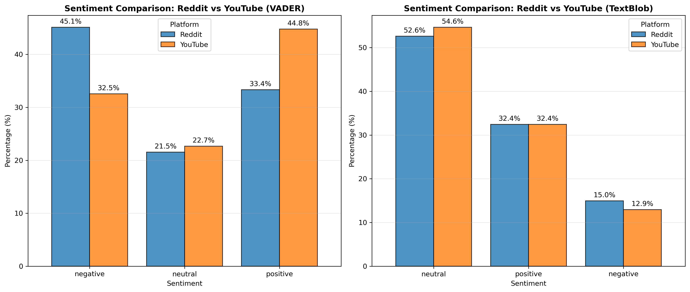

### Subjectivity vs. Polarity
We mapped comments on a Subjectivity-Polarity axis.

*   **YouTube** comments cluster in the **high-subjectivity, high-polarity** quadrants (emotional, opinionated).

*   **Reddit** comments are more distributed, with a significant portion in the **lower-subjectivity** region, indicating attempts at factual (or pseudo-factual) argumentation.

More subjectivity = More polarization as well.

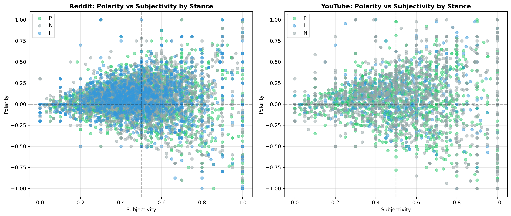

## Content Length & Structure
The structural differences are stark:

*   **Reddit:** Long-tail distribution with many comments exceeding 100 words. This "essayist" culture supports complex framing.

*   **YouTube:** Extremely short, often single-sentence comments. This "shouting" culture supports slogans.

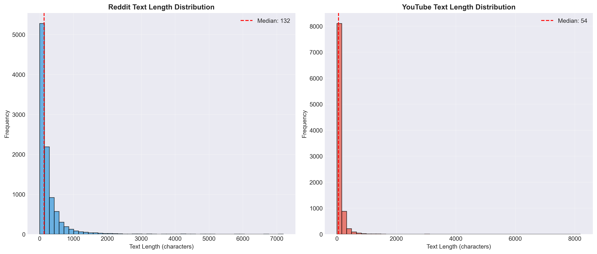

## Topic Modeling (LDA & NMF)
The vocabulary used on each platform reflects its distinct culture:

*   **Reddit** focuses on **Geopolitics & History**: Words like *State, Land, History, Apartheid, Government*.

*   **YouTube** focuses on **Religion & Solidarity**: Words like *God, Pray, Free, Love, Support, Muslim*.

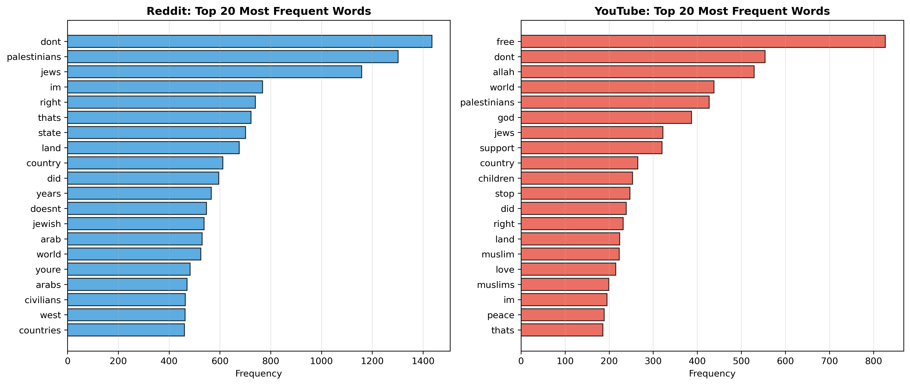

---

# The Depth of Discourse (Advanced Statistics)

We went beyond simple sentiment to measure complexity and engagement dynamics.

## Linguistic Complexity
Using the Flesch Reading Ease score, we found that **Reddit comments are significantly more complex** than YouTube comments. Reddit fosters long-form argumentation, while YouTube encourages short, slogan-based reactions.

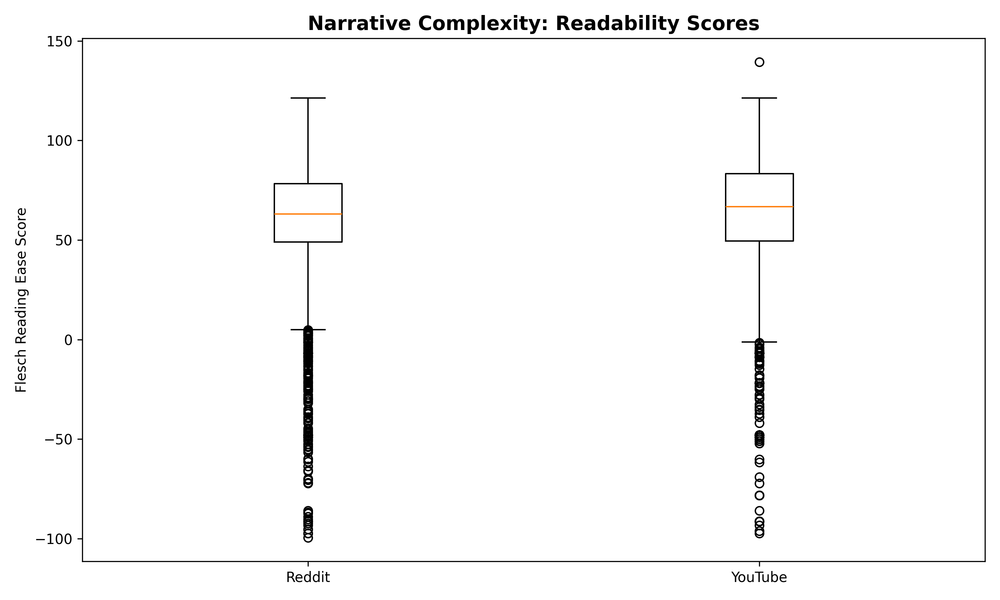

### Complexity by Stance
Interestingly, complexity varies by political alignment:

*   **Pro-Israel** comments tend to be slightly more complex/formal, often citing policy or history.

*   **Pro-Palestine** comments are more accessible and emotional, aiming for broader appeal.

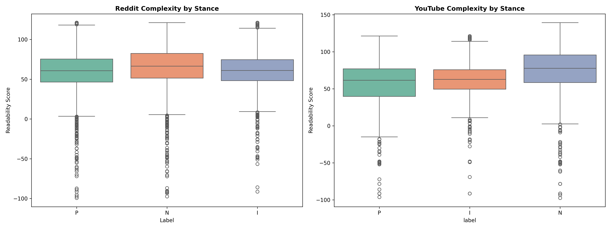

## Temporal Dynamics & Amplification

*   **Response Time (Reddit):** The median response time on Reddit is **360 minutes (6 hours)**. This confirms that Reddit functions as a "slow" platform, allowing for deliberative, asynchronous debate rather than real-time chat.

*   **Algorithmic Amplification:** We analyzed the `controversiality` flag on Reddit. Contrary to the belief that "controversy drives engagement," we found that **controversial comments (mixed up/down votes) receive significantly lower net scores (Avg: 2.2)** compared to non-controversial ones (Avg: 12.7). The community effectively penalizes divisive content through downvotes.

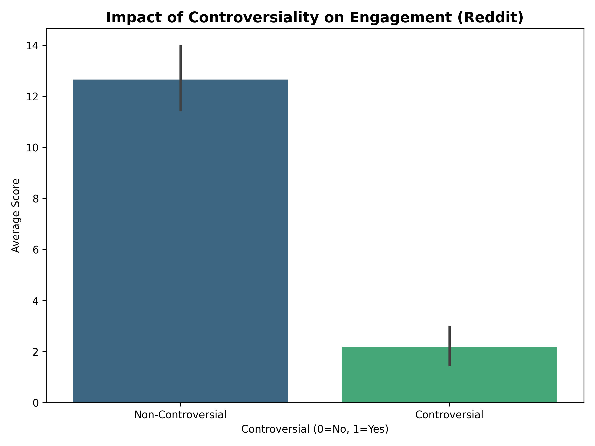

<!-- #### Engagement Correlations
The correlation heatmap reveals that **Sentiment** has almost **zero correlation** with **Score** (Upvotes). Users do not upvote based on "positivity"; they upvote based on **agreement with the stance**, regardless of how angry or happy the comment is.

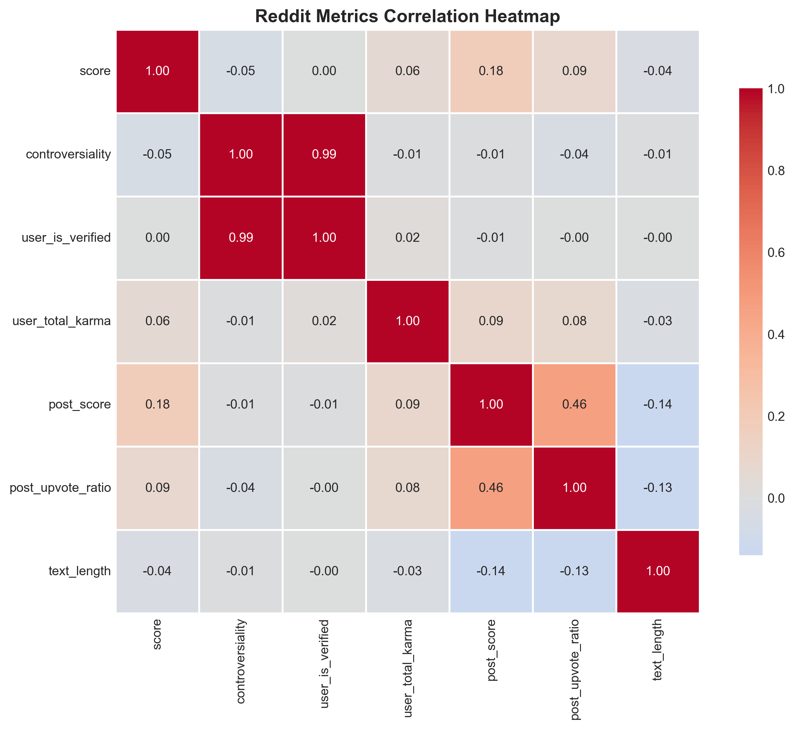 -->

## Conversation Volume
Reddit threads are deeper (Avg 29.5 comments/post) compared to YouTube (Avg 21.5 comments/video), supporting the finding that Reddit fosters sustained discussion while YouTube leans towards "shouting into the void."

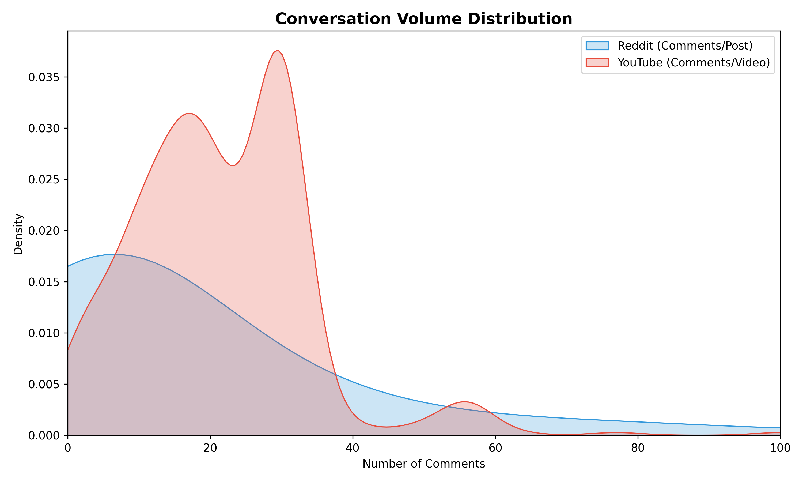

---

# The Trenches (Machine Learning & Networks)

We trained machine learning models to classify user stance and mapped interaction networks to find echo chambers.

## Stance Classification (Ensemble Model)
Our Voting Classifier (LR + SVM + RF + GB) achieved strong results within each platform but struggled with cross-platform generalization, highlighting the distinct linguistic norms of each space.

| Train Set | Test Set | Accuracy | Insight |
| :--- | :--- | :--- | :--- |
| **YouTube** | **YouTube** | **75.1%** | High accuracy; repetitive slogans make prediction easier. |
| **Reddit** | **Reddit** | **62.5%** | Moderate accuracy; sarcasm and nuance make prediction harder. |
| **Reddit** | **YouTube** | **61.9%** | Models trained on Reddit fail to capture YouTube's specific slang. |
| **YouTube** | **Reddit** | **57.2%** | **Lowest performance**; YouTube models are too simple for Reddit. |

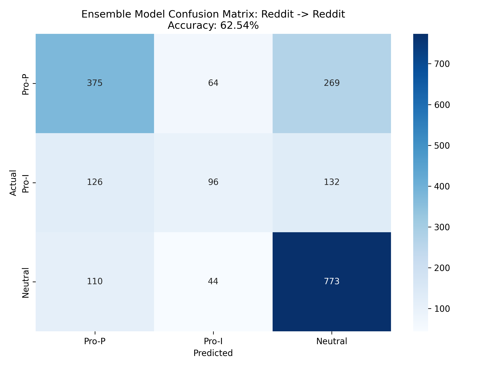

### Feature Importance
The models relied on distinct vocabularies:

*   **Pro-Palestine:** `genocide`, `apartheid`, `children`, `innocent`.

*   **Pro-Israel:** `hamas`, `terrorist`, `hostages`, `defend`.

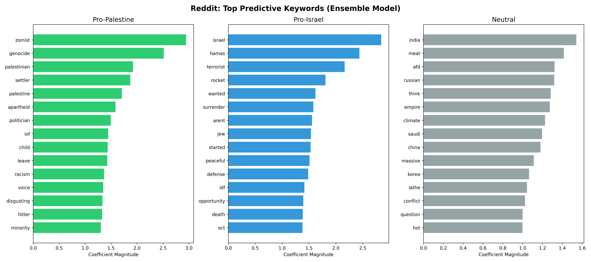

## Echo Chambers & Homophily
We constructed a user interaction network to measure **Homophily**: *The tendency of users to interact primarily with others of the same stance.*

*   **Homophily Index Definition:** Calculated as the proportion of a user's comments that appear in threads dominated by their own stance.

*   **Pro-Palestine Users (High Homophily):** They exhibit strong in-group preference, mostly commenting on supportive threads.

*   **Pro-Israel Users (Moderate Homophily):** They are more likely to engage in "cross-cutting" debate (or brigading) on opposing threads.

### Network Visualization
The graph below represents users as nodes and interactions as edges. The clear separation of clusters (colored by stance) visually confirms the existence of echo chambers, with only a few "bridge" users connecting the two sides.

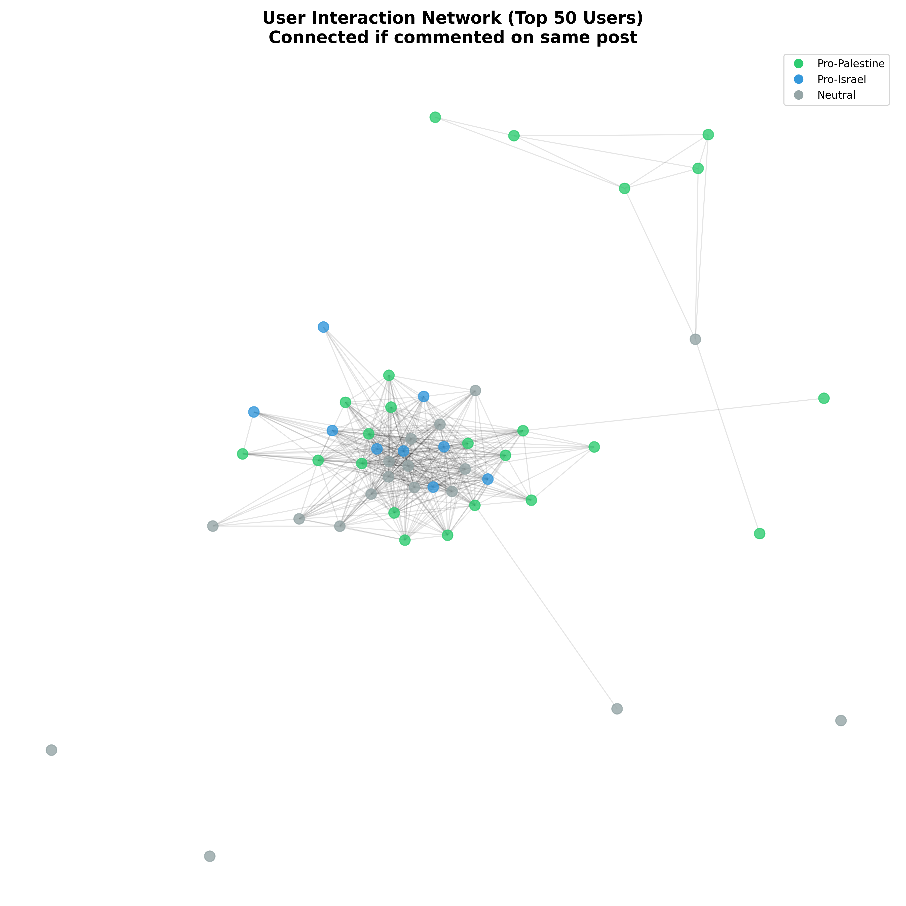

---

# The Toxicity Report (Perspective API)

Using Google's Perspective API, we conducted a critical analysis of harmful speech attributes: `TOXICITY`, `IDENTITY_ATTACK`, and `THREAT`.

## Platform Toxicity & Identity Attacks
**Reddit is the more toxic platform.** The anonymity and debate culture likely fuel higher aggression compared to YouTube's community guidelines and social norms.

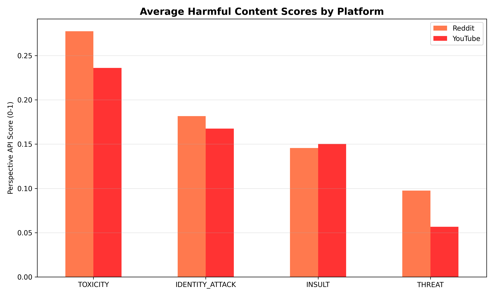

*   **Identity Attacks:** Reddit also scores higher on `IDENTITY_ATTACK` (0.18 vs 0.17). This metric specifically measures hateful speech targeting race, religion, or ethnicity. The high prevalence of this on Reddit suggests that the "intellectual debate" often devolves into ad hominem attacks on identity groups.

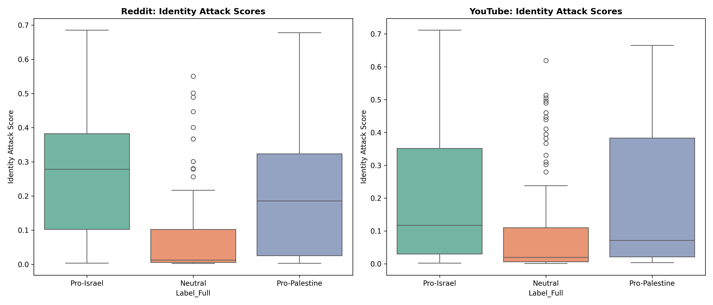

## Toxicity by Stance
A critical finding was the asymmetry in toxicity levels:

*   **Pro-Israel** comments were the **most toxic** on both platforms (Reddit: 0.35, YouTube: 0.26).

*   **Pro-Palestine** comments were close behind (Reddit: 0.31, YouTube: 0.24).

*   **Neutral** comments were significantly less toxic.

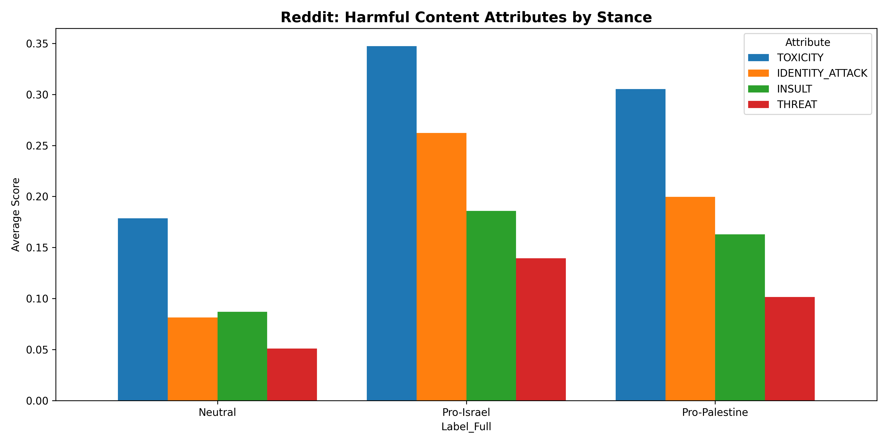

---

# Final Synthesis

This study demonstrates that **the medium is the message**.

1.  **Architecture Matters:** Reddit's threaded structure and unlimited text length create a **complex, toxic, and polarized debate chamber**. YouTube's flat structure and visual focus create a **supportive, emotional, and simpler rally**.

2.  **Asymmetric Polarization:** Pro-Palestine users exhibit stronger **echo chamber behavior** (sticking to their own), while Pro-Israel users are more **confrontational** (higher toxicity and cross-thread engagement).

3.  **The Cost of Debate:** While Reddit offers deeper intellectual engagement (higher complexity), it comes at the cost of significantly higher toxicity and hostility compared to YouTube.

