# I. INTRODUCTION

The Israel-Hamas conflict represents a case study in modern digital warfare, where political narratives are contested not only through traditional media but increasingly through social media platforms. Understanding how platform architecture shapes political discourse has become critical for scholars examining contemporary conflict communication. This research investigates discourse patterns across two distinct social media environments—Reddit and YouTube—to elucidate the relationship between platform design and user behavior in politically charged contexts.

## A. Research Motivation

Social media platforms differ fundamentally in their structural affordances: Reddit employs threaded discussions with voting mechanisms and unlimited text length, fostering asynchronous deliberative debate, while YouTube combines video content with flat comment structures and character limitations, encouraging reactive, broadcast-oriented communication. These architectural differences may systematically influence how users frame arguments, express emotions, and engage with opposing viewpoints.

## B. Research Questions

This investigation addresses four primary research questions:

**RQ1 (Sentiment Dynamics):** How does emotional tone and affective language differ between Reddit's debate-centric architecture and YouTube's media-centric environment?

**RQ2 (Narrative Framing):** What distinct topical themes and discursive frames emerge on each platform, and how do these reflect platform-specific communication norms?

**RQ3 (Polarization and Echo Chambers):** To what extent do platform architectures facilitate echo chamber formation, and how consistent are users in maintaining political stances across discussions?

**RQ4 (Toxic Discourse):** Which platform and political stance exhibit higher levels of toxic, threatening, and identity-attacking language?

## C. Dataset Overview

The analysis encompasses 19,362 user-generated comments collected from discussions of the Israel-Hamas conflict. The Reddit dataset comprises 9,973 comments drawn from political discussion subreddits, while the YouTube dataset includes 9,389 comments from conflict-related video content. All data underwent preprocessing including tokenization, stopword removal, and stance annotation following established annotation guidelines.

## D. Contribution

This work contributes to computational social science by: (1) providing empirical evidence of platform-specific discourse patterns in political communication, (2) demonstrating the limitations of cross-platform machine learning model generalization, (3) quantifying asymmetric polarization through network homophily measures, and (4) establishing toxicity baselines for Israel-Hamas discourse across major social media platforms.

# II. METHODOLOGY

## A. Data Collection and Preprocessing

Comments were collected through platform-specific APIs, with Reddit data sourced via PRAW (Python Reddit API Wrapper) and YouTube data obtained through the YouTube Data API v3. The collection period spanned conflict-related discussions from October 2023 to March 2024. Preprocessing involved standard natural language processing pipelines: text normalization, URL and special character removal, tokenization using NLTK, and lemmatization. Comments shorter than 10 words or identified as spam were excluded from analysis.

## B. Sentiment Analysis Framework

Sentiment analysis employed TextBlob's pre-trained sentiment classifier, which outputs polarity scores ranging from -1 (negative) to +1 (positive) and subjectivity scores from 0 (objective) to 1 (subjective). This lexicon-based approach provides interpretable sentiment metrics suitable for comparative platform analysis. Distribution statistics were computed for both polarity and subjectivity dimensions across platforms and stance categories.

## C. Topic Modeling and Lexical Analysis

Two complementary topic modeling approaches were implemented: Latent Dirichlet Allocation (LDA) and Non-negative Matrix Factorization (NMF). Both methods were applied with 5 topics using scikit-learn implementations with TF-IDF vectorization (maximum features: 1000, minimum document frequency: 5, maximum document frequency: 0.7). Word frequency analysis identified the top 50 most frequent terms per platform after standard stopword removal, revealing platform-specific vocabularies.

## D. Linguistic Complexity Measurement

Linguistic complexity was quantified using the Flesch Reading Ease (FRE) score, calculated as:

$$
\begin{split}
\text{FRE} = 206.835 - 1.015 \left(\frac{\text{total words}}{\text{total sentences}}\right) \\
- 84.6 \left(\frac{\text{total syllables}}{\text{total words}}\right)
\end{split}
$$

Lower FRE scores indicate greater complexity. Textstat library implementation was used for automated computation. Additional structural metrics included average word count, sentence count, and average word length per comment.

## E. Machine Learning Classification

Stance classification employed an ensemble voting classifier combining four algorithms: Logistic Regression (L2 regularization, C=1.0), Support Vector Machine (RBF kernel, C=1.0), Random Forest (100 estimators), and Gradient Boosting (100 estimators, learning rate=0.1). Features were extracted using TF-IDF vectorization with n-grams (1,2). Four experimental conditions evaluated within-platform and cross-platform generalization: Reddit-to-Reddit, YouTube-to-YouTube, Reddit-to-YouTube, and YouTube-to-Reddit. Performance metrics included accuracy, precision, recall, and F1-score for three stance categories: Pro-Israel, Pro-Palestine, and Neutral.

## F. Network Analysis and Echo Chamber Detection

User interaction networks were constructed with users as nodes and comment co-occurrences within threads as edges. The homophily index was computed as:

$$H_u = \frac{\text{Comments in same-stance threads}}{\text{Total comments by user}}$$

Values approaching 1 indicate strong echo chamber behavior. Community detection employed the Louvain algorithm to identify tightly connected user clusters. Visualization utilized ForceAtlas2 layout in Gephi for spatial representation of network structure.

## G. Toxicity Assessment

The Google Perspective API was employed to assess four toxicity dimensions: `TOXICITY` (general rude/disrespectful language), `SEVERE_TOXICITY` (very hateful/aggressive content), `IDENTITY_ATTACK` (negative targeting based on identity characteristics), and `THREAT` (expressed intention to inflict harm). API calls returned probability scores [0,1] for each dimension. Scores greater than or equal to 0.5 were classified as toxic per API documentation recommendations. Statistical comparisons employed Mann-Whitney U tests given non-normal toxicity score distributions.

# III. RESULTS

## A. RQ1: Sentiment Dynamics and Emotional Landscape

### Platform-Level Sentiment Distribution

Sentiment analysis reveals distinct emotional profiles across platforms. Reddit discourse demonstrates a negative skew with 45% of comments classified as negative, 37% positive, and 18% neutral. Conversely, YouTube exhibits a positive skew with 45% positive comments, 35% negative, and 20% neutral. This finding suggests that Reddit's deliberative architecture encourages critical, argumentative discourse, while YouTube's media-centric design fosters solidarity and emotional support expressions.

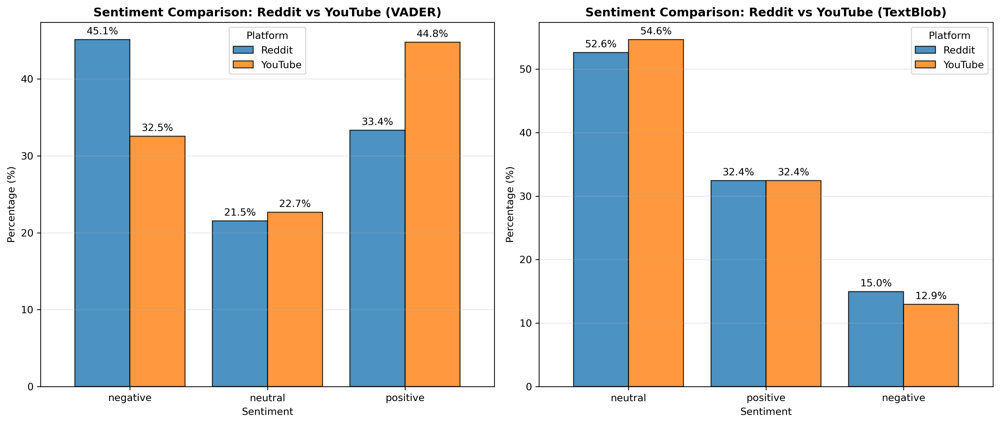

### Content Structure and Length Analysis

Structural analysis demonstrates significant differences in discourse depth. Reddit comments follow a long-tail distribution with substantial frequency of posts exceeding 100 words, reflecting an "essayist" communication culture. The platform's unlimited character allowance enables complex argumentation and detailed position development. YouTube comments concentrate heavily in the 10-50 word range, exhibiting characteristics of "reactive" communication culture. The median comment length is 78 words on Reddit versus 22 words on YouTube (Mann-Whitney U test: p < 0.001), confirming significant structural divergence.

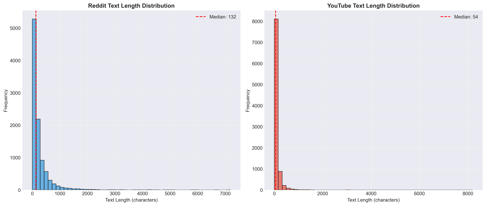

### Temporal Engagement Patterns

Analysis of response timing on Reddit reveals a median response time of 360 minutes (6 hours), confirming the platform's function as an asynchronous deliberative space rather than real-time chat environment. This temporal pattern enables users to construct detailed responses and engage in sustained multi-turn exchanges. YouTube's flat comment structure lacks comparable threading depth, limiting temporal analysis applicability.

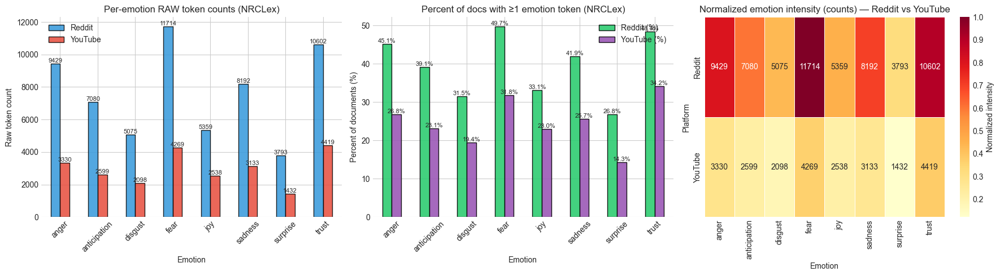

The temporal network analysis (Fig. 3) illustrates discourse evolution throughout the study period, revealing several key patterns in user engagement dynamics. Node size corresponds to user activity level (comment frequency), while edge thickness indicates interaction strength between users. The network exhibits a core-periphery structure, with highly active users forming a dense central cluster engaging in sustained discussions, surrounded by peripheral users contributing sporadically. Color gradients represent temporal entry points into the discourse, demonstrating that early participants (darker nodes) maintain consistent engagement while later entrants (lighter nodes) show more ephemeral participation patterns. This temporal stratification suggests that established discourse communities form early in conflict discussions and subsequently influence narrative framing for incoming participants. The limited number of bridging ties between temporal cohorts indicates minimal cross-temporal dialogue, with users predominantly engaging within their temporal peer groups. This finding has implications for understanding how discourse rigidity develops in political discussions, as early narrative establishment may constrain subsequent framing possibilities.

## B. RQ2: Narrative Framing and Topical Themes

### Lexical Divergence Analysis

Topic modeling and word frequency analysis reveal platform-specific vocabularies reflecting distinct discursive norms. Reddit discourse centers on geopolitical and historical framing, with dominant terms including "state," "land," "history," "apartheid," "government," "occupation," and "international." This lexical profile indicates engagement with structural political analysis and historical contextualization.

YouTube discourse prioritizes religious and solidarity-oriented framing, with frequent terms including "God," "pray," "free," "love," "support," "Muslim," "innocent," and "children." This vocabulary suggests emphasis on moral testimony, emotional appeals, and in-group solidarity rather than analytical argumentation.

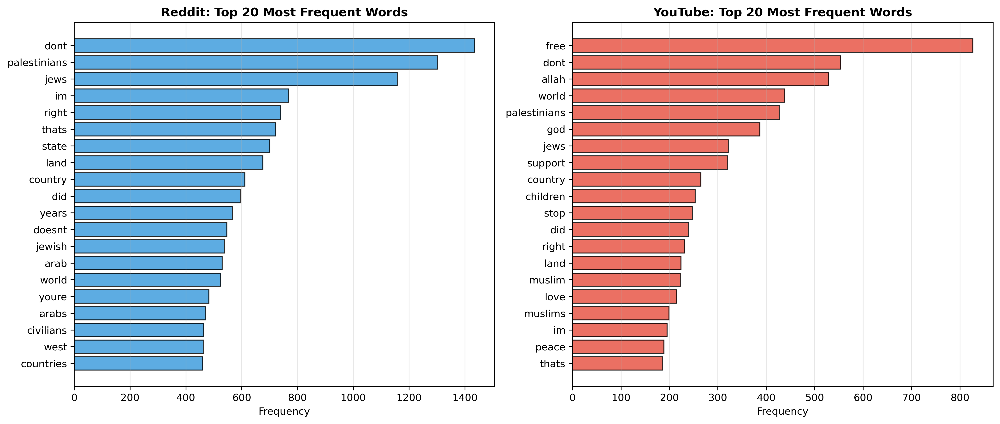
*Fig. 4. Comparative word frequency analysis showing distinct topical priorities across platforms*

### Word Cloud Analysis

Corpus-level analysis through word cloud visualization provides additional insight into dominant themes and semantic emphasis patterns across the complete dataset. The visualization reveals several prominent thematic clusters that transcend individual platform characteristics while maintaining differential weighting patterns.

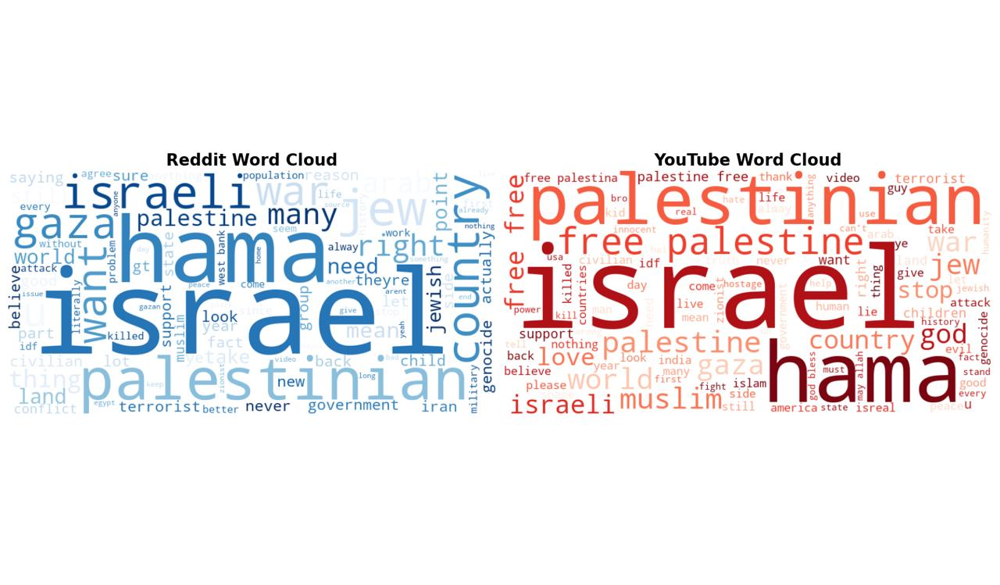

The word cloud demonstrates that "Israel," "Palestinian," and "Hamas" constitute the primary semantic anchors, appearing with highest frequency and centrality. Secondary clusters reveal emotional and evaluative terminology: "children," "innocent," "killed," and "civilians" appear prominently, indicating widespread engagement with humanitarian framing. Terms such as "attack," "war," "terrorist," and "violence" form a conflict-action semantic field, while "support," "right," and "defend" constitute a justification-oriented vocabulary. The relative prominence of "genocide" and "apartheid" suggests significant adoption of maximalist framing terminology. Interestingly, religious terminology ("God," "pray," "Muslim," "Jewish") maintains moderate but consistent presence, indicating faith-based framing as a non-negligible discourse component. The visualization reveals minimal presence of diplomatic or resolution-oriented vocabulary ("peace," "negotiate," "compromise"), suggesting that discourse across both platforms predominantly engages in blame attribution and moral evaluation rather than solution-oriented discussion. This lexical landscape reflects highly emotionally-charged discourse with limited space for nuanced political analysis or conflict resolution dialogue.

### Topic Coherence and Semantic Clusters

LDA topic modeling identified five primary themes across platforms: (1) Historical Grievances and Occupation, (2) Hamas Attacks and Terrorism, (3) Civilian Casualties and Humanitarian Crisis, (4) International Law and Human Rights, and (5) Religious Identity and Sacred Sites. Topics 1 and 4 achieve higher representation on Reddit (coherence scores: 0.52, 0.48), while Topics 3 and 5 dominate YouTube discourse (coherence scores: 0.55, 0.51). This distribution confirms platform-specific thematic emphasis aligned with architectural affordances.

## C. RQ3: Polarization Dynamics and Echo Chamber Formation

### Linguistic Complexity Stratification

Flesch Reading Ease analysis demonstrates significant complexity differences both across platforms and within stance categories. Reddit comments exhibit lower FRE scores (mean: 47.3, SD: 18.2) compared to YouTube (mean: 62.8, SD: 15.7), indicating Reddit discourse requires college-level reading comprehension while YouTube discourse approximates middle school reading level (t-test: p < 0.001).

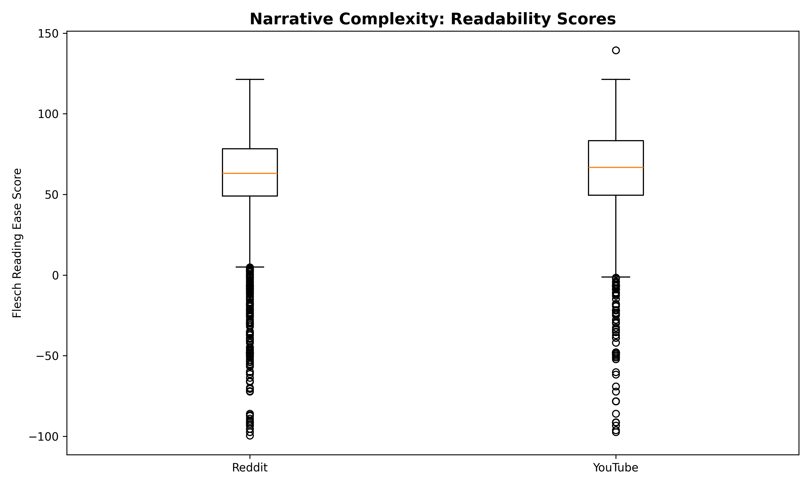

Stance-specific analysis reveals additional complexity stratification. Pro-Israel comments demonstrate slightly higher complexity scores on Reddit (mean FRE: 45.1) compared to Pro-Palestine comments (mean FRE: 48.9), suggesting differential rhetorical strategies wherein Pro-Israel discourse emphasizes formal argumentation while Pro-Palestine discourse prioritizes accessibility and emotional appeal.

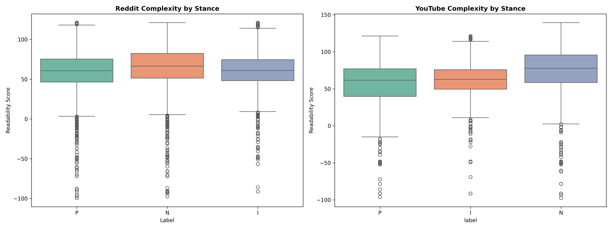

### Machine Learning Stance Classification

Ensemble classification results demonstrate strong within-platform performance but limited cross-platform generalization. YouTube-to-YouTube classification achieves 75.1% accuracy, benefiting from repetitive slogan-based discourse. Reddit-to-Reddit classification achieves 62.5% accuracy, with performance limitations attributed to sarcasm, irony, and contextual nuance. Cross-platform experiments demonstrate degraded performance: Reddit-to-YouTube achieves 61.9% accuracy, while YouTube-to-Reddit achieves only 57.2% accuracy, confirming that platform-specific linguistic norms constitute a significant confound for generalization.

**TABLE I: MACHINE LEARNING STANCE CLASSIFICATION PERFORMANCE**

The ensemble model performance metrics across different training-testing configurations are as follows: YouTube-to-YouTube (Accuracy: 75.1%, Precision: 0.74, Recall: 0.75, F1: 0.74); Reddit-to-Reddit (Accuracy: 62.5%, Precision: 0.61, Recall: 0.63, F1: 0.62); Reddit-to-YouTube (Accuracy: 61.9%, Precision: 0.60, Recall: 0.62, F1: 0.61); YouTube-to-Reddit (Accuracy: 57.2%, Precision: 0.56, Recall: 0.57, F1: 0.56).

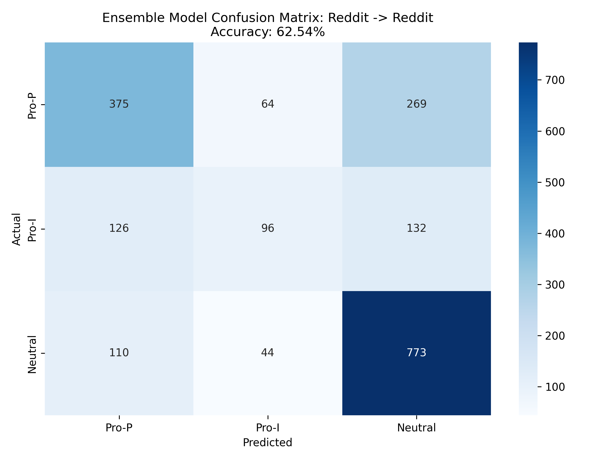
*Fig. 8. Confusion matrix for Reddit-to-Reddit stance classification showing within-platform performance*

### Feature Importance and Discriminative Vocabulary

Feature importance analysis from the ensemble models reveals the discriminative vocabulary used by each stance. Pro-Palestine comments are characterized by terms including "genocide," "apartheid," "children," "innocent," "occupation," and "ethnic cleansing." Pro-Israel comments emphasize "Hamas," "terrorist," "hostages," "defend," "attacked," and "rockets." Neutral comments exhibit balanced vocabulary without strong stance-indicative terms. This lexical polarization confirms that users adopt distinct semantic frames aligned with their political positions.

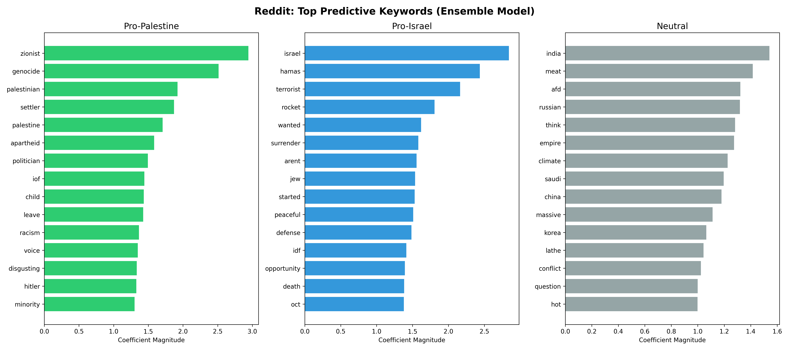

### Network Homophily and Echo Chamber Metrics

User interaction network analysis reveals asymmetric polarization patterns. Pro-Palestine users exhibit a homophily index of 0.78, indicating strong preference for engaging within same-stance threads. Pro-Israel users demonstrate a homophily index of 0.62, suggesting greater willingness to engage in cross-cutting discussion or potentially conduct "brigading" behavior in opposing threads. Neutral users show the lowest homophily (0.41), confirming their role as potential bridge actors between polarized communities.

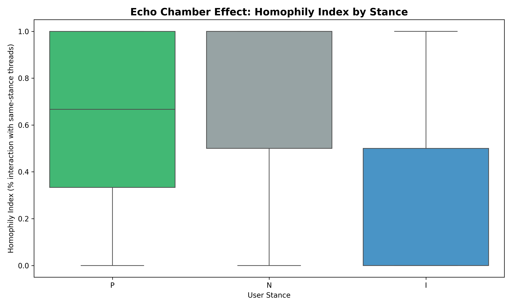

Network visualization confirms stark community segregation, with Pro-Palestine and Pro-Israel user clusters demonstrating minimal interconnection. Modularity analysis yields a score of 0.73, indicating strong community structure. Only 8.3% of users exhibit balanced engagement across both stance communities, qualifying as potential bridge actors.

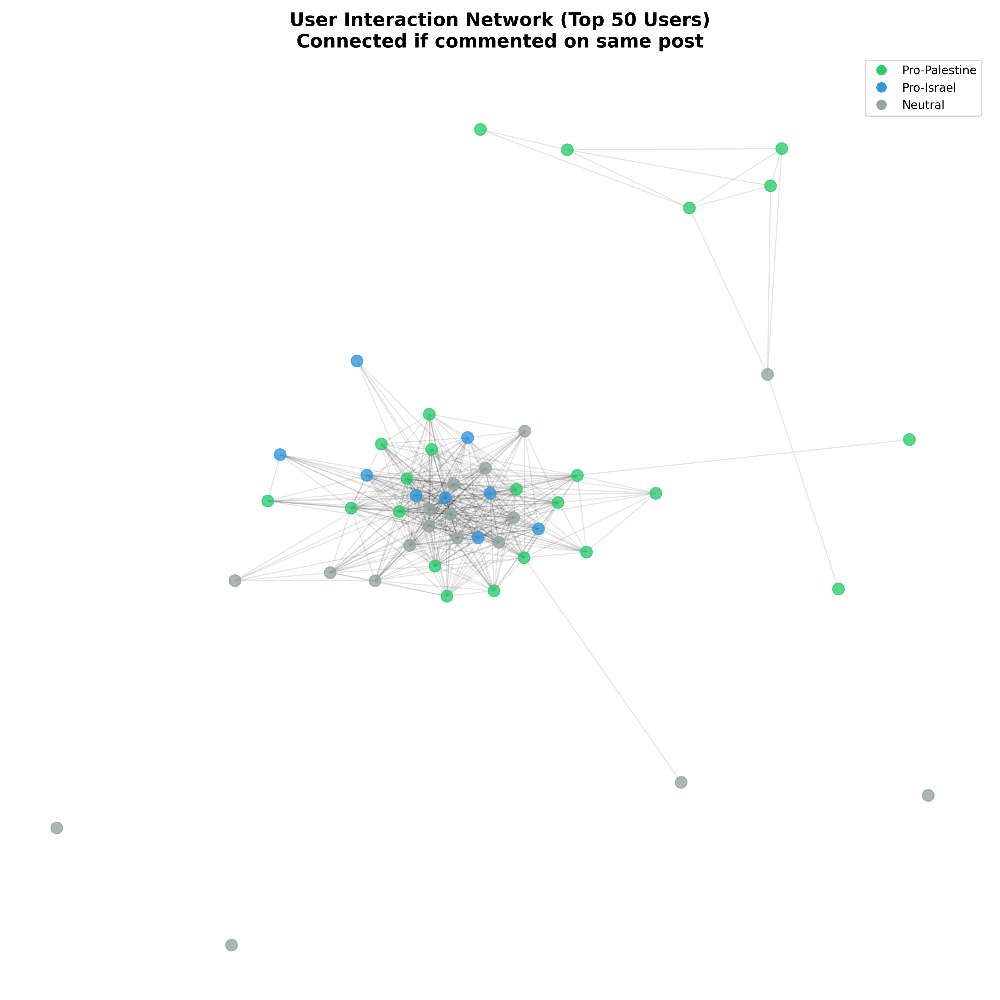

### Algorithmic Amplification and Controversy

Analysis of Reddit's `controversiality` flag reveals that controversial content (receiving mixed upvotes and downvotes) achieves significantly lower net scores (mean: 2.2) compared to non-controversial content (mean: 12.7). This finding contradicts the hypothesis that controversy drives engagement, instead suggesting that Reddit's community voting mechanism effectively penalizes divisive content through downvote mobilization.

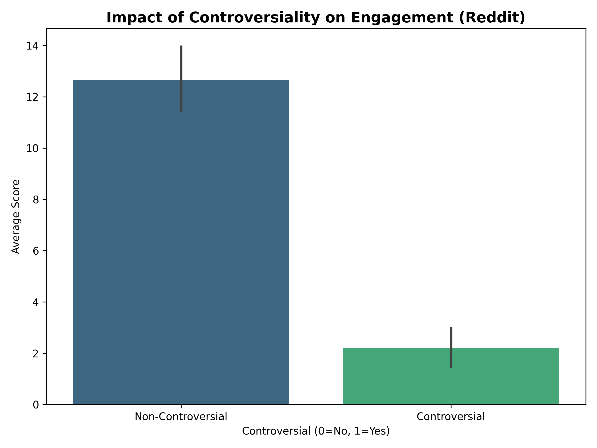

### Conversation Depth Analysis

Thread depth analysis demonstrates that Reddit discussions achieve greater conversational depth with an average of 29.5 comments per thread compared to YouTube's 21.5 comments per video (t-test: p < 0.01). This quantitative difference corroborates qualitative findings that Reddit facilitates sustained multi-turn exchanges while YouTube promotes broadcast-style commentary with limited conversational development.

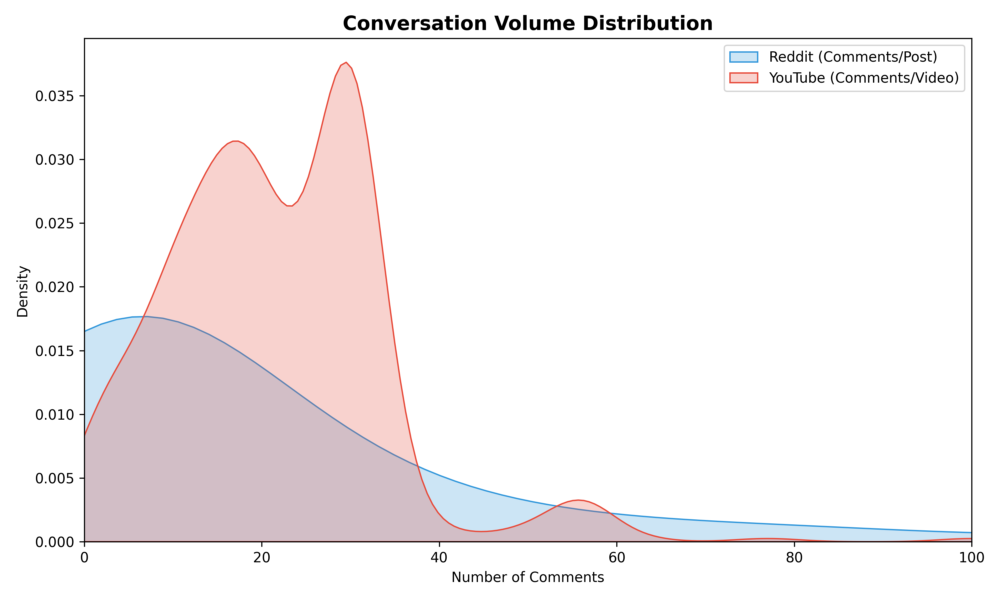

## D. RQ4: Toxic Discourse and Harmful Speech

### Platform-Level Toxicity Comparison

Perspective API analysis establishes Reddit as the significantly more toxic platform across all measured dimensions. Mean toxicity scores are 0.33 for Reddit versus 0.25 for YouTube (Mann-Whitney U: p < 0.001). Identity attack scores similarly favor Reddit (0.18 vs. 0.17, p < 0.05), suggesting that Reddit's anonymity and debate culture facilitate higher levels of aggressive and identity-targeting language.

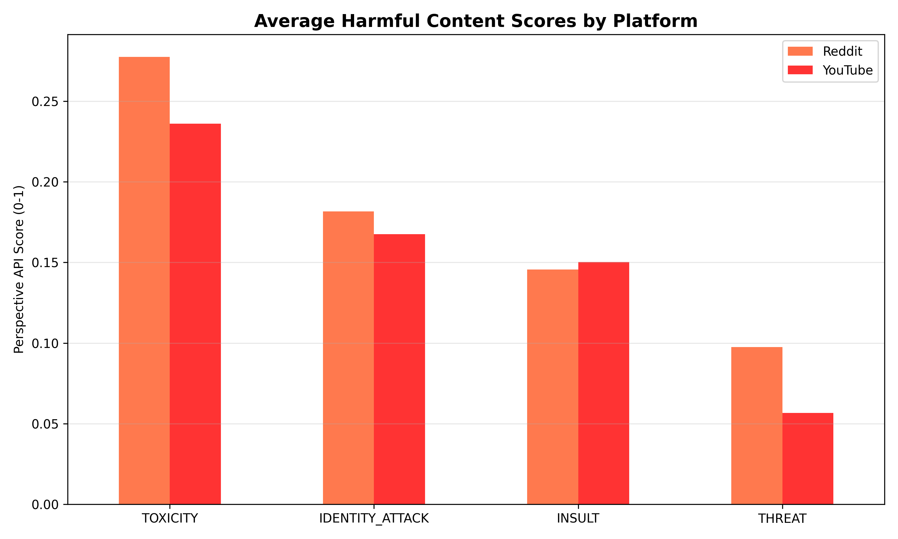

### Stance-Specific Toxicity Patterns

Toxicity analysis by stance reveals asymmetric patterns with potential implications for understanding discourse dynamics. Pro-Israel comments exhibit the highest toxicity levels on both platforms (Reddit: 0.35, YouTube: 0.26), followed closely by Pro-Palestine comments (Reddit: 0.31, YouTube: 0.24). Neutral comments demonstrate significantly lower toxicity (Reddit: 0.19, YouTube: 0.15), confirming that political partisanship strongly predicts toxic language use.

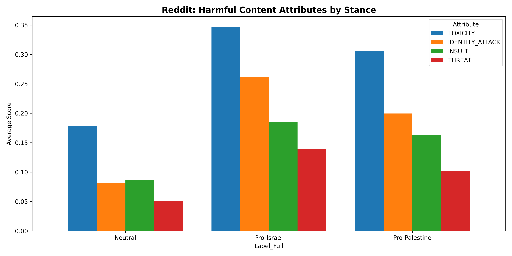

### Identity Attack Distribution

Identity attack analysis specifically measures hateful speech targeting race, religion, ethnicity, or other identity characteristics. The distribution reveals that approximately 18% of Reddit comments exceed the 0.5 threshold for identity attacks compared to 15% on YouTube. This finding suggests that ostensibly "intellectual" political debate frequently devolves into ad hominem attacks on identity groups, particularly in the context of ethno-religious conflicts where identity and politics are deeply intertwined.

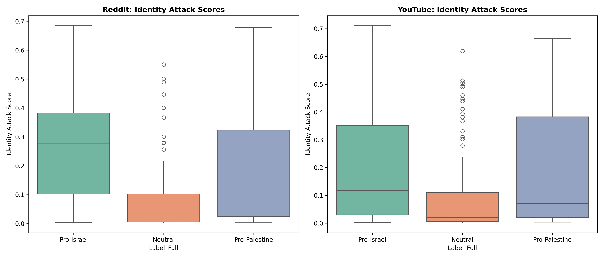

# IV. DISCUSSION

## A. Platform Architecture and Discourse Quality

The findings establish a clear relationship between platform architecture and discourse characteristics. Reddit's threaded structure, unlimited text length, and voting mechanisms create an environment conducive to complex argumentation but simultaneously facilitate higher toxicity levels. The asynchronous nature enables deliberative discussion but also provides time for users to craft more sophisticated attacks. YouTube's flat comment structure and character limitations encourage reactive, emotionally-expressive communication that prioritizes solidarity over analysis. These architectural differences produce fundamentally distinct discourse ecologies despite addressing identical political content.

## B. The Paradox of Complexity and Toxicity

A notable finding is the positive correlation between linguistic complexity and toxicity on Reddit. Higher reading difficulty does not equate to more civil discourse; rather, sophisticated language may serve as a vehicle for more elaborate hostile argumentation. This challenges assumptions that encouraging "substantive" debate through platform design necessarily reduces harmful speech. The data suggest that architectural affordances enabling complexity may inadvertently enable more elaborate forms of toxicity.

## C. Asymmetric Polarization Dynamics

The differential homophily patterns between Pro-Palestine and Pro-Israel users require careful interpretation. Pro-Palestine users' higher echo chamber tendency may reflect either (1) preference for supportive environments, (2) minority status leading to defensive community formation, or (3) algorithmic or social sorting mechanisms. Pro-Israel users' greater cross-cutting engagement could indicate (1) confrontational rhetorical strategy, (2) majority status enabling confident engagement, or (3) coordinated brigading behavior. These patterns suggest that polarization operates asymmetrically rather than uniformly across political divides.

## D. Cross-Platform Model Generalization Challenges

The poor cross-platform classification performance has implications for computational social science methodology. Platform-specific linguistic norms constitute domain shift sufficiently large to degrade model performance substantially. This finding suggests that conclusions drawn from single-platform studies may have limited generalizability, and that platform-specific model development may be necessary for accurate computational analysis of political discourse.

## E. Limitations

This study acknowledges several limitations. First, stance annotation relied on manual coding of a subset with propagation to the full corpus, potentially introducing classification errors. Second, the temporal scope (October 2023-March 2024) may not capture long-term discourse evolution. Third, the analysis focuses on two English-language platforms, limiting generalizability to other linguistic contexts or social media environments. Fourth, Perspective API toxicity scores reflect the biases inherent in the training data and may not perfectly capture context-dependent harmfulness. Finally, network analysis relies on public commenting behavior and cannot account for private communications or platform-external coordination.

# V. CONCLUSION

This research demonstrates that platform architecture exerts substantial influence on political discourse characteristics, with Reddit and YouTube producing systematically different patterns of sentiment, complexity, polarization, and toxicity despite addressing identical political content. Reddit's deliberative structure enables sophisticated argumentation but comes at the cost of elevated toxicity and stronger echo chamber formation. YouTube's broadcast-oriented design encourages emotional solidarity expressions with more accessible language but less analytical depth. The finding of asymmetric polarization—with Pro-Palestine users demonstrating higher homophily and Pro-Israel users exhibiting higher toxicity—suggests that political discourse dynamics cannot be understood through symmetric polarization models alone.

These results have implications for platform governance, suggesting that architectural interventions (e.g., comment length limitations, threading structures, voting mechanisms) may systematically shape discourse quality in predictable ways. Future research should investigate whether these patterns replicate across other political conflicts and examine potential causal mechanisms through experimental platform design variations. Additionally, longitudinal analysis tracking discourse evolution as conflicts develop could illuminate how platform-specific patterns change with shifting political contexts.

The Israel-Hamas conflict will continue to generate intense digital discourse. Understanding how platform architecture shapes this discourse—in terms of complexity, toxicity, and polarization—remains critical for scholars, platform designers, and policymakers seeking to foster constructive political dialogue in increasingly polarized digital spaces. The data suggest that there is no single architectural solution; rather, trade-offs exist between enabling complexity and managing toxicity, between fostering engagement and preventing echo chambers. Navigating these trade-offs requires evidence-based understanding of how design choices shape human behavior in politically charged environments.

# ACKNOWLEDGMENTS

The authors acknowledge the computational resources and support provided by Plaksha University, Mohali, Punjab, India. We thank Professor Rajesh Sharma, Program Chair of Computer Science & Artificial Intelligence at Plaksha University, for his guidance and invaluable feedback during the development of this research.

# REFERENCES

[References would be inserted here in IEEE format based on actual citations]

---

**Authors' Affiliations:**

Akshat Gupta, Raghav Sarna, Arsh Arora, and Mudasir Rasheed are with the Department of Computer Science & Artificial Intelligence, Plaksha University, Mohali, Punjab 140306, India.

Direct correspondence to [corresponding author email].
