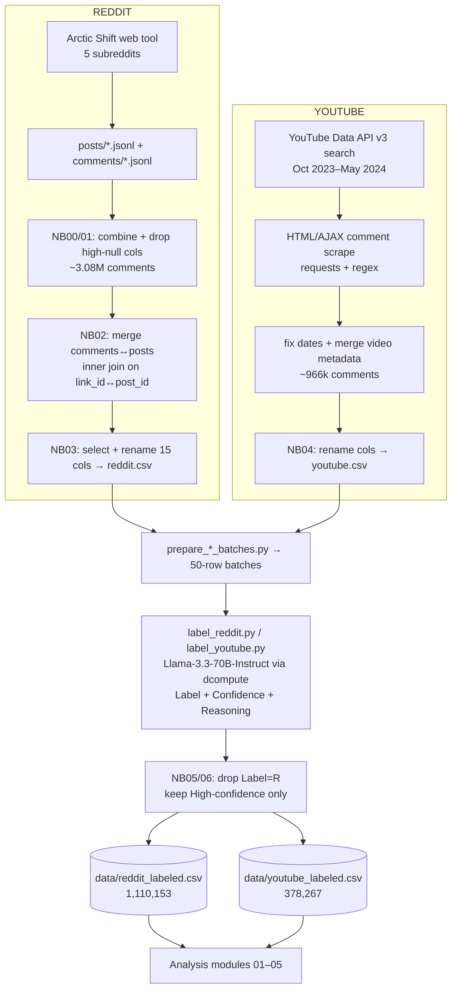

# Israel–Hamas Discourse Analysis - A Comparative Study of Reddit and YouTube

A computational social-science study of online political discourse around the
Israel–Hamas conflict, comparing how two platforms with very different
architectures - **Reddit** (threaded, debate-centric) and **YouTube**
(media-centric, reply-light) - shape public conversation. The project covers the
**entire pipeline**: large-scale data collection, LLM-assisted stance labeling,
cleaning, and five analysis modules answering four research questions about
emotional tone, narratives, polarization/echo chambers, and toxic speech.

> **Scale:** ~1.11M labeled Reddit comments + ~0.38M labeled YouTube comments
> (≈ **1.49M** stance-labeled data points) drawn from a much larger raw crawl
> (~3.08M Reddit + ~0.97M YouTube comments before labeling/filtering).

---

## Table of Contents

1. [Research Questions](#research-questions)
2. [Key Findings (preliminary)](#key-findings-preliminary)
3. [Repository Layout](#repository-layout)
4. [The Full Data Pipeline](#the-full-data-pipeline)
   - [Stage 0 · Overview diagram](#stage-0--overview)
   - [Stage 1 · Reddit collection (Arctic Shift)](#stage-1--reddit-collection-arctic-shift)
   - [Stage 2 · Reddit preprocessing](#stage-2--reddit-preprocessing)
   - [Stage 3 · YouTube collection](#stage-3--youtube-collection)
   - [Stage 4 · YouTube preprocessing](#stage-4--youtube-preprocessing)
   - [Stage 5 · LLM stance labeling](#stage-5--llm-stance-labeling)
   - [Stage 6 · Final datasets](#stage-6--final-datasets)
5. [Annotation Guidelines (stance labels)](#annotation-guidelines-stance-labels)
6. [Final Dataset Schemas](#final-dataset-schemas)
7. [Analysis Modules (01–05)](#analysis-modules-0105)
8. [Setup](#setup)
9. [How to Run](#how-to-run)
10. [Methodology Details](#methodology-details)
11. [Configuration (.env)](#configuration-env)
12. [Tech Stack](#tech-stack)
13. [Limitations &amp; Ethics](#limitations--ethics)
14. [Authors, Citation, License](#authors-citation-license)

---

## Research Questions

| RQ            | Question                                                      | Module                         |
| ------------- | ------------------------------------------------------------- | ------------------------------ |
| **RQ1** | How does emotional tone differ between platforms and stances? | `02_emotional_tone_analysis` |
| **RQ2** | What distinct topics and narratives emerge?                   | `03_topics_and_narratives`   |
| **RQ3** | Do echo chambers exist and are users polarized?               | `04_echo_chambers`           |
| **RQ4** | Which platform / stance harbors the most toxic speech?        | `05_toxicity_analysis`       |

**Stance labels (used throughout):** `P` = Pro-Palestine · `I` = Pro-Israel · `N` = Neutral.
(`R` = Irrelevant is used during labeling and then filtered out - see [Stage 5](#stage-5--llm-stance-labeling).)

---

## Key Findings (preliminary)

> ⚠️ **These are preliminary, from an earlier, smaller dataset and have not yet been
> regenerated on the current extensive data.** Treat them as hypotheses to confirm
> or revise. Re-run notebooks 01–05 on the full `data/` and read conclusions off the
> fresh output; the notebooks deliberately avoid hard-coding any result.

- **RQ1 (Tone):** Reddit skewed more negative; YouTube more positive. Sentiment varied by stance within each platform.
- **RQ2 (Topics):** Reddit framing leaned political/territorial; YouTube leaned emotional/religious/solidarity. Pro-Palestine emphasized "genocide"; Pro-Israel emphasized "civilians/terrorists".
- **RQ3 (Echo chambers):** Active users showed a clear dominant stance with high consistency; a measurable share interacted almost exclusively in same-stance threads. Stance was predictable from text within a platform but generalized poorly across platforms.
- **RQ4 (Toxicity):** Toxicity and identity-attack levels differed by platform and stance.

---

## Repository Layout

```
israel_hamas_discourse_analysis/
│
├── 00_data_collection_and_labeling/        ← raw collection, cleaning, LLM labeling
│   ├── ANNOTATION_GUIDELINES.md            stance label definitions (P/I/N/R)
│   ├── reddit_raw_data/
│   │   ├── posts/      r_<subreddit>_posts.jsonl      (5 subreddits, Arctic Shift)
│   │   └── comments/   r_<subreddit>_comments.jsonl   (5 subreddits, Arctic Shift)
│   ├── notebooks/                          Kaggle-developed preprocessing notebooks
│   │   ├── 00_reddit_posts_preprocessing.ipynb
│   │   ├── 01_reddit_comments_preprocessing.ipynb
│   │   ├── 02_reddit_merge_datasets.ipynb
│   │   ├── 03_reddit_data_preprocessing.ipynb
│   │   ├── 04_youtube_data_preprocessing.ipynb
│   │   ├── 05_reddit_json_preprocessing.ipynb
│   │   └── 06_youtube_json_preprocessing.ipynb
│   ├── scripts/
│   │   ├── prepare_reddit_batches.py        split CSV → 50-row labeling batches
│   │   ├── prepare_youtube_batches.py
│   │   ├── label_reddit.py                  async LLM stance labeling (Llama 3.3 70B)
│   │   ├── label_youtube.py
│   │   └── youtube-comment-scraper/         YouTube collection toolkit (API + scrape)
│   │       ├── yt_scrape_optimized.py       primary: API search + HTML/AJAX comment scrape
│   │       ├── ytb_comment_scraper.py       earlier web-scraper variant
│   │       ├── resume_comments.py           resume scraping from existing metadata
│   │       ├── backfill_aug_sep_2023.py     extend window back to Aug–Sep 2023
│   │       ├── fetch_transcripts.py         captions via youtube-transcript-api
│   │       ├── fix_comments_date_csv.py     relative "x days ago" → ISO dates
│   │       └── runner.py
│   └── outputs/                             intermediate + labeled artifacts (gitignored)
│
├── 01_data_preparation/                     Cleaning & EDA
│   ├── data_preprocessing.ipynb            type conversion → final data/ (documentation)
│   ├── exploratory_analysis.ipynb          EDA: quality, stance, length, engagement, time
│   ├── scripts/eda_analysis.py
│   └── main.py
│
├── 02_emotional_tone_analysis/              RQ1 - Sentiment
│   ├── sentiment_analysis.ipynb            VADER + TextBlob, stats tests, exports sentiment CSVs
│   ├── scripts/{sentiment_analysis,statistical_tests}.py
│   └── outputs/                            reddit_with_sentiment.csv, youtube_with_sentiment.csv
│
├── 03_topics_and_narratives/                RQ2 - Topics
│   ├── topic_analysis.ipynb                LDA + NMF, word frequency, TF-IDF, word clouds
│   ├── scripts/{topic_modeling,generate_wordclouds}.py
│   └── outputs/
│
├── 04_echo_chambers/                        RQ3 - Polarization
│   ├── network_analysis.ipynb              OLS, readability, homophily, network, ML stance model
│   ├── scripts/{advanced_analysis,structural_temporal_analysis,network_analysis,ml_stance_classification}.py
│   └── outputs/
│
├── 05_toxicity_analysis/                    RQ4 - Toxicity
│   ├── toxicity_assessment.ipynb           Google Perspective API toxicity scoring
│   ├── scripts/toxicity_assessment.py
│   └── outputs/
│
├── data/                                    FINAL labeled datasets (gitignored)
│   ├── reddit_labeled.csv                   1,110,153 rows
│   └── youtube_labeled.csv                  378,267 rows
│
├── docs/                                    report (markdown / IEEE / PDF), annotation PDF
├── requirements.txt
├── .env                                     secrets (gitignored)
└── README.md
```

> **Note on paths:** the `00_*` preprocessing notebooks were developed on **Kaggle**
> and contain `/kaggle/input` / `/kaggle/working` paths. They document *how the data
> was built* and are not required to re-run locally - the final datasets already live
> in `data/`. The **analysis** notebooks (01–05) have been rewritten to resolve all
> paths relative to the repo root and run anywhere.

---

## The Full Data Pipeline

### Stage 0 · Overview



---

### Stage 1 · Reddit collection (Arctic Shift)

Reddit data was collected with the **[Arctic Shift](https://github.com/ArthurHeitmann/arctic_shift)** tool **via its web interface** (`arctic-shift.photon-reddit.com`), which serves historical Reddit dumps. We exported **posts and comments** for five conflict-relevant subreddits over roughly **August 2023 → May 2024**:

- `r/AskMiddleEast`
- `r/IsraelPalestine`
- `r/Israel`
- `r/IsraelPalestineWar_23`
- `r/Palestine`

Each export is a newline-delimited JSON (`.jsonl`) file per subreddit, stored under
`00_data_collection_and_labeling/reddit_raw_data/{posts,comments}/`. The records use
the standard Reddit/Pushshift schema (posts: `id, title, selftext, created_utc, score, upvote_ratio, num_comments, author, subreddit, permalink, …`; comments: `id, body, created_utc, score, author, link_id, parent_id, controversiality, subreddit, …`).

Raw volume: **~3.08M comments** across the five subreddits (plus the corresponding posts).

### Stage 2 · Reddit preprocessing

Performed by the `00_*/notebooks/` notebooks (developed on Kaggle):

| Notebook                                   | What it does                                                                                                                                                                                                                              |
| ------------------------------------------ | ----------------------------------------------------------------------------------------------------------------------------------------------------------------------------------------------------------------------------------------- |
| `00_reddit_posts_preprocessing.ipynb`    | Combine the 5 post JSONLs; drop columns with**> 5% nulls**; export `reddit_posts.csv`.                                                                                                                                            |
| `01_reddit_comments_preprocessing.ipynb` | Chunked load (120k rows/chunk) of the 5 comment JSONLs (**3,083,006** comments); drop columns with **> 6% nulls**; export `reddit_comments.csv`.                                                                            |
| `02_reddit_merge_datasets.ipynb`         | Prefix columns `comment_*` / `post_*`; **inner-join** comments to posts on `comment_link_id` (strip `t3_`) ↔ `post_id`; export `reddit.csv`.                                                                           |
| `03_reddit_data_preprocessing.ipynb`     | Select & rename**15 analysis columns** (e.g. `comment_body → self_text`, `comment_created_utc → created_time`, `post_created_utc → post_created_time`); export `reddit_cleaned.csv`.                                     |
| `05_reddit_json_preprocessing.ipynb`     | Post-labeling: EDA on `reddit_labeled_full.jsonl`, then **filter** (drop `Label=="R"`, keep only **high-confidence** rows), drop the `Confidence`/`__row_index` helper columns, and produce the final Reddit dataset. |

### Stage 3 · YouTube collection

YouTube data was collected with a custom toolkit in
`00_data_collection_and_labeling/scripts/youtube-comment-scraper/`:

- **Video discovery** - `yt_scrape_optimized.py` queries the **YouTube Data API v3**
  (`search.list`, ordered by view count) with ~16 core + ~12 backfill conflict-related
  queries, restricted to **2023-10-07 → 2024-05-07**, yielding ~2.6k unique videos.
  Video metadata (title, channel, publish date) comes from `videos.list` (batched 50/req).
- **Comment scraping** - comments are scraped directly from YouTube's HTML + AJAX
  continuation endpoints using `requests` + regex (parsing both legacy `commentRenderer`
  and newer `commentEntityPayload` structures). This avoids the API comment quota.
- **Supporting scripts** - `resume_comments.py` (resume without re-querying),
  `backfill_aug_sep_2023.py` (extend the window earlier), `fetch_transcripts.py`
  (captions via `youtube-transcript-api`), `fix_comments_date_csv.py` (convert relative
  "x days ago" timestamps to ISO dates and attach `video_date`).

Raw volume: **~966,027 comments**.

### Stage 4 · YouTube preprocessing

| Notebook                                | What it does                                                                                                                                                                                                                                           |
| --------------------------------------- | ------------------------------------------------------------------------------------------------------------------------------------------------------------------------------------------------------------------------------------------------------ |
| `04_youtube_data_preprocessing.ipynb` | Ingest the scraped/date-fixed comments; rename to analysis columns (`comment_text → text`, `votes → likeCount`, `comment_published_at_approx → created_time`, `comment_id → id`); export `youtube_cleaned.csv` (**966,027** rows). |
| `06_youtube_json_preprocessing.ipynb` | Post-labeling: from `youtube_labeled_full.jsonl` (**741,078** labeled rows) drop `Label=="R"` and keep only **high-confidence** rows; drop helper columns → final YouTube dataset (**~378k**).                                  |

### Stage 5 · LLM stance labeling

Both platforms were labeled by the **same automated annotator** so the stance scheme
is consistent across Reddit and YouTube.

- **Model:** `meta-llama/Llama-3.3-70B-Instruct`, served through **dcompute** (an
  OpenAI-compatible endpoint; `AsyncOpenAI` client pointed at `DCOMPUTE_BASE_URL`).
- **Prompt:** an expert-annotator system prompt embedding the full
  [annotation guidelines](#annotation-guidelines-stance-labels) (label definitions +
  examples). Each item is shown with its context (Reddit: subreddit, post title/body,
  comment, score, controversiality; YouTube: comment, video id, author, likes).
- **Output schema (per item):** JSON `{ "index", "Label" (P/I/N/R), "Confidence" (High/Medium/Low), "Reasoning" }`. Invalid labels are normalized to `N`.
- **Throughput & robustness:** input CSVs are split into **50-row batches**
  (`prepare_*_batches.py` + a `manifest.json`); labeling runs **asynchronously**
  (concurrency = 5) in **waves** with per-wave JSONL checkpoints and a
  `*_progress_full.json` file, so runs **resume after interruption**. Defaults:
  `temperature=0.1`, `max_retries=10` (exponential backoff capped at 30s),
  `batch_size=50`, `max_output_tokens` up to 16000 (all overridable via `.env`).
- **Output:** `reddit_labeled_full.jsonl` / `youtube_labeled_full.jsonl` = original
  columns + `index`, `Label`, `Confidence`, `Reasoning`.

### Stage 6 · Final datasets

The labeled JSONLs are filtered (Stage 2/4 notebooks) by **(1) dropping `Label == "R"`
(Irrelevant)** and **(2) keeping only high-confidence labels**, then dropping the
`Confidence`/`__row_index` helper columns. The result is the canonical analysis data:

| Stage                                    | Reddit                | YouTube           |
| ---------------------------------------- | --------------------- | ----------------- |
| Raw comments collected                   | ~3,083,006            | 966,027           |
| Labeled (full)                           | (all merged comments) | 741,078           |
| **Final (non-R, high-confidence)** | **1,110,153**   | **378,267** |
| - Pro-Palestine (P)                     | 494,608               | 212,217           |
| - Pro-Israel (I)                        | 370,616               | 131,357           |
| - Neutral (N)                           | 244,929               | 34,693            |

These two files (`data/reddit_labeled.csv`, `data/youtube_labeled.csv`) are the input
to every analysis module. (`data/` is gitignored.)

---

## Annotation Guidelines (stance labels)

Full text in [`00_data_collection_and_labeling/ANNOTATION_GUIDELINES.md`](00_data_collection_and_labeling/ANNOTATION_GUIDELINES.md).

| Label       | Meaning            | Definition (abridged)                                                                                              |
| ----------- | ------------------ | ------------------------------------------------------------------------------------------------------------------ |
| **P** | Supports Palestine | Advocates for Palestinian rights, statehood, sovereignty, self-determination; criticizes Israeli actions/policies. |
| **I** | Supports Israel    | Supports Israel's security, sovereignty, territorial integrity, right to self-defense.                             |
| **N** | Neutral / Unclear  | Impartial, ambiguous, balanced, or question-only; no definitive side.                                              |
| **R** | Irrelevant         | Off-topic / spam / unrelated to the conflict.**Filtered out** of the final datasets.                         |

"Stance" = the expressed or implied position toward the Israel–Gaza war. `R` is
filtered first; the analysis datasets contain only `P`, `I`, `N`.

---

## Final Dataset Schemas

### `data/reddit_labeled.csv` (1,110,153 rows × 18 cols)

| Column                | Description                                    |
| --------------------- | ---------------------------------------------- |
| `index`             | Row index from labeling                        |
| `Label`             | Stance: P / I / N                              |
| `Reasoning`         | LLM justification for the label                |
| `self_text`         | Comment body (primary text field)              |
| `comment_id`        | Reddit comment id                              |
| `score`             | Comment score (net upvotes)                    |
| `author_name`       | Comment author                                 |
| `controversiality`  | 0/1 controversiality flag                      |
| `created_time`      | Comment timestamp                              |
| `subreddit`         | Source subreddit                               |
| `post_id`           | Parent post id (thread)                        |
| `parent_id`         | Direct parent (`t1_` comment / `t3_` post) |
| `permalink`         | Reddit permalink                               |
| `post_title`        | Title of the parent post                       |
| `post_score`        | Score of the parent post                       |
| `post_upvote_ratio` | Upvote ratio of the parent post                |
| `post_created_time` | Parent post timestamp                          |
| `num_comments`      | Comment count on the parent post               |

### `data/youtube_labeled.csv` (378,267 rows × 10 cols)

| Column           | Description                       |
| ---------------- | --------------------------------- |
| `index`        | Row index from labeling           |
| `Label`        | Stance: P / I / N                 |
| `Reasoning`    | LLM justification for the label   |
| `id`           | YouTube comment id                |
| `video id`     | YouTube video id                  |
| `author`       | Comment author handle             |
| `text`         | Comment body (primary text field) |
| `likeCount`    | Like count                        |
| `created_time` | Comment date (approximate)        |
| `video_date`   | Publish date of the video         |

---

## Analysis Modules (01–05)

All analysis notebooks are **self-contained, run top-to-bottom, resolve paths relative
to the repo root**, and combine computation, statistical tests, and visualizations.
Heavy steps run on the full data where cheap; the ML ensemble trains on a capped
stratified sample, and word clouds / readability use large stratified samples (noted
in-notebook) so each notebook finishes in a reasonable time.

### `01_data_preparation/`

- **`data_preprocessing.ipynb`** - documents the final type-conversion/cleaning step
  (numeric like-counts, datetime parsing, nullable ints). Idempotent and robust to both
  raw (Unix-epoch) and already-clean inputs.
- **`exploratory_analysis.ipynb`** - EDA: dataset shape/quality/missingness, stance
  distribution per platform, comment-length analysis (words, by stance), engagement
  (log-scaled, outlier-capped scores/likes), daily temporal volume, top subreddits/videos.

### `02_emotional_tone_analysis/` - RQ1

- **`sentiment_analysis.ipynb`** - scores every comment with **VADER** (compound, social-media tuned) and **TextBlob** (polarity + subjectivity); compares sentiment by platform and stance (tables, heatmaps, box plots, polarity-vs-subjectivity); runs **statistical tests** - chi-square + **Cramér's V** (stance × sentiment), **Kruskal-Wallis** (compound across stances), **Mann-Whitney U** (platform contrast); reports **effect sizes** (rank-biserial, epsilon-squared); adds a **transformer model** (`cardiffnlp/twitter-roberta-base-sentiment-latest`) on a stratified sample and measures **inter-method agreement with Cohen's kappa** (VADER / TextBlob / RoBERTa); plots monthly sentiment trends. **Exports** `reddit_with_sentiment.csv` / `youtube_with_sentiment.csv` for downstream modules.

### `03_topics_and_narratives/` - RQ2

- **`topic_analysis.ipynb`** - domain-stopword-aware **word frequency** (overall + by stance), **LDA** and **NMF** topic models, **TF-IDF** distinctive terms per stance, and **word clouds** by stance and by sentiment. Topic quality is quantified with **c_v coherence** (gensim) — including a **coherence-vs-K sweep to justify the number of topics** — and an embedding-based **BERTopic** model (sentence-transformers + UMAP + HDBSCAN) is run on a sample as a modern alternative. Loads module-02 sentiment output (fallback: recompute VADER from `data/`).

### `04_echo_chambers/` - RQ3

- **`network_analysis.ipynb`** - engagement **OLS** (`score ~ sentiment + stance`, with from-scratch coef/SE/p-value inference), controversiality amplification, **Flesch readability** (dependency-free) by platform/stance, **vectorized user stance profiling** (dominant stance + consistency over ~100k authors via group-bys), **homophily-based echo-chamber detection**, a **user-interaction network** (bipartite projection of top users), and a **scalable stance-classification ensemble** (Logistic Regression + calibrated LinearSVC + Random Forest, soft voting) tested within- and cross-platform with per-stance predictive keywords and **Stratified 5-fold cross-validated macro-F1 (mean ± 95% CI)**. Kruskal-Wallis tests report **epsilon-squared** effect sizes.

### `05_toxicity_analysis/` - RQ4

- **`toxicity_assessment.ipynb`** - scores a stratified sample with **Google Perspective API** across TOXICITY, SEVERE_TOXICITY, IDENTITY_ATTACK, INSULT, THREAT, PROFANITY; compares by platform and stance; **Mann-Whitney U** (platform) + **Kruskal-Wallis** (stance) tests with **rank-biserial / epsilon-squared** effect sizes. Requires a Perspective API key (see [Configuration](#configuration-env)); without one the notebook stops gracefully with setup instructions.

---

## Setup

```bash
# 1. (recommended) create / activate a virtual environment, then:
pip install -r requirements.txt

# 2. place the final labeled data (gitignored) in data/
#    data/reddit_labeled.csv
#    data/youtube_labeled.csv

# 3. (only for RQ4) add a Perspective API key - see Configuration below
```

The repo was validated with **Python 3.12** and current scientific-Python
(pandas 3.0, numpy 2.x, scikit-learn 1.8, seaborn 0.13, matplotlib 3.10).

---

## How to Run

The notebooks are the primary interface and run **top to bottom**. Run them in
module order:

1. `01_data_preparation/exploratory_analysis.ipynb`
2. `02_emotional_tone_analysis/sentiment_analysis.ipynb` - **run before 03–05**
3. `03_topics_and_narratives/topic_analysis.ipynb`
4. `04_echo_chambers/network_analysis.ipynb`
5. `05_toxicity_analysis/toxicity_assessment.ipynb`

**Data flow:** notebook 02 writes `reddit_with_sentiment.csv` / `youtube_with_sentiment.csv`
into `02_emotional_tone_analysis/outputs/`. Notebooks 03–05 load those if present and
otherwise **fall back** to `data/*_labeled.csv` and recompute VADER on the fly - so each
notebook also runs standalone (just slower if 02 hasn't been run).

The `00_*` collection/labeling artifacts and `data_preprocessing.ipynb` document how
the data was produced and do **not** need to be re-run; the final data already lives in
`data/`. The per-folder `scripts/` and `main.py` files are the original batch
equivalents kept for reference.

---

## Methodology Details

- **Sentiment** - VADER (primary, intensity-aware) + TextBlob (polarity/subjectivity) +
  a **transformer** (`twitter-roberta-base-sentiment`) on a stratified sample. Standard
  VADER thresholds (compound ≥ 0.05 positive, ≤ −0.05 negative). With ~1.5M observations,
  **effect sizes** (Cramér's V for chi-square, rank-biserial for Mann-Whitney, epsilon-squared
  for Kruskal-Wallis) accompany every p-value so significance isn't mistaken for importance.
  Inter-method **agreement is reported with Cohen's kappa**.
- **Topics** - LDA (online, batched) and NMF (TF-IDF, `nndsvda` init); shared domain terms
  (israel, gaza, hamas, …) are added to the stopword list so *differentiating* vocabulary
  surfaces. Topic quality is measured with **c_v coherence**, the **number of topics is chosen
  by a coherence-vs-K sweep** rather than fixed, and **BERTopic** (embeddings + UMAP + HDBSCAN)
  is compared as a neural alternative. Multiple models guard against single-algorithm artefacts.
- **Polarization** - user dominant-stance + consistency; a **homophily index** (share of a
  user's distinct threads whose majority stance matches their own); a bipartite
  user–thread network projected to user–user; OLS with proper inference; Flesch readability.
- **Stance ML** - TF-IDF (1–2 grams, 5k features) → soft-voting ensemble (LR + calibrated
  LinearSVC + RandomForest). Trained on a **capped stratified 60k sample** (so the SVM is
  tractable), evaluated within-platform and cross-platform with macro-F1, confusion matrices,
  and **Stratified 5-fold cross-validated macro-F1 (mean ± 95% CI)**.
- **Toxicity** - Google Perspective API on a stratified per-stance sample (rate-limit aware);
  scored samples are persisted so the API work is reusable; effect sizes accompany the tests.

---

## Configuration (.env)

`.env` lives in the repo root (gitignored). Variables used by the pipeline:

```text
# LLM stance labeling (dcompute, OpenAI-compatible)
DCOMPUTE_BASE_URL=...           # OpenAI-compatible endpoint
DCOMPUTE_API_KEY=...
DCOMPUTE_MODEL=meta-llama/Llama-3.3-70B-Instruct

# Labeling tuning (all optional, with defaults)
LABEL_MAX_RETRIES=10
LABEL_TEMPERATURE=0.1
LABEL_MAX_OUTPUT_TOKENS=16000
LABEL_MAX_WORKERS=5
LABEL_BATCH_SIZE=50

# Labeling file paths (input / output / progress / batch dirs)
REDDIT_INPUT_FILE=...   REDDIT_OUTPUT_FILE=...   REDDIT_PROGRESS_FILE=...   REDDIT_BATCHES_DIR=...
YOUTUBE_INPUT_FILE=...  YOUTUBE_OUTPUT_FILE=...  YOUTUBE_PROGRESS_FILE=...

# RQ4 toxicity (add this to run module 05)
PERSPECTIVE_API_KEY=your_key_here
```

Get a Perspective API key: [https://developers.perspectiveapi.com/s/docs-get-started](https://developers.perspectiveapi.com/s/docs-get-started).

### Reproducing data collection (advanced)

```bash
# Reddit: export the 5 subreddits' posts+comments via the Arctic Shift web tool,
#         place the .jsonl files under 00_.../reddit_raw_data/, then run NB 00→03.

# YouTube: collect with the scraper toolkit
python 00_data_collection_and_labeling/scripts/youtube-comment-scraper/yt_scrape_optimized.py

# Labeling (after building reddit.csv / youtube.csv)
python 00_data_collection_and_labeling/scripts/prepare_reddit_batches.py  --input data/reddit.csv  --out-dir data/reddit_batches  --batch-size 50
python 00_data_collection_and_labeling/scripts/label_reddit.py            # uses DCOMPUTE_* + REDDIT_BATCHES_DIR
python 00_data_collection_and_labeling/scripts/prepare_youtube_batches.py --input data/youtube.csv --out-dir data/youtube_batches --batch-size 50
python 00_data_collection_and_labeling/scripts/label_youtube.py
# then run NB 05 / 06 to filter (drop R, keep high-confidence) into data/*_labeled.csv
```

---

## Tech Stack

- **Data:** pandas, numpy
- **NLP / sentiment:** vaderSentiment, TextBlob, **transformers** (`twitter-roberta` sentiment), scikit-learn (CountVectorizer/TfidfVectorizer, LDA, NMF), wordcloud
- **Topics:** scikit-learn (LDA/NMF), **gensim** (c_v coherence), **BERTopic** (sentence-transformers + UMAP + HDBSCAN)
- **Stats:** scipy (chi-square, Kruskal-Wallis, Mann-Whitney), numpy OLS, effect sizes (Cramér's V, rank-biserial, epsilon-squared), Cohen's kappa
- **ML:** scikit-learn (LogisticRegression, LinearSVC + CalibratedClassifierCV, RandomForest, VotingClassifier, Stratified K-fold CV)
- **Networks:** networkx
- **Toxicity:** google-api-python-client (Perspective API)
- **Collection / labeling:** requests, google-api-python-client (YouTube Data API v3), youtube-transcript-api, openai (AsyncOpenAI → dcompute), Arctic Shift (Reddit, web)
- **Viz:** matplotlib, seaborn

> `statsmodels` and `textstat` appear in `requirements.txt` for the original `scripts/`;
> the rewritten **notebook 04 is dependency-free** (its OLS and Flesch readability are
> implemented directly), so it runs even if those two packages are absent.

---

## Limitations & Ethics

- **Automated labeling.** Stances were assigned by an LLM (Llama-3.3-70B), not human
  annotators. Only non-`R`, high-confidence labels are kept, but residual model bias /
  error is possible; `Reasoning` is retained for auditability.
- **Sampling & coverage.** YouTube comments were scraped (not via the official comment
  API) within a fixed window and query set; Reddit covers five subreddits. Neither is a
  complete census of the discourse.
- **Platform asymmetry.** Reddit (threaded) and YouTube (flat) differ structurally;
  cross-platform comparisons control for this where possible but are not perfectly matched.
- **Sensitive topic.** This studies real discourse about an active conflict. Findings
  describe *online text patterns*, not ground truth about the conflict, and should not be
  read as endorsement of any stance.
- **Toxicity scores** come from a third-party model (Perspective) with its own known biases.

---

## Authors, Citation, License

**Authors:** Akshat Gupta, Raghav Sarna, Arsh Arora.

License: see [`LICENSE`](LICENSE).

> If you use this work, please cite the report in `docs/` and credit the data sources
> (Reddit via Arctic Shift; YouTube Data API v3).
